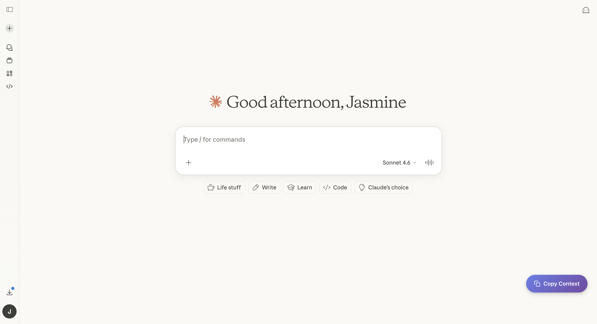
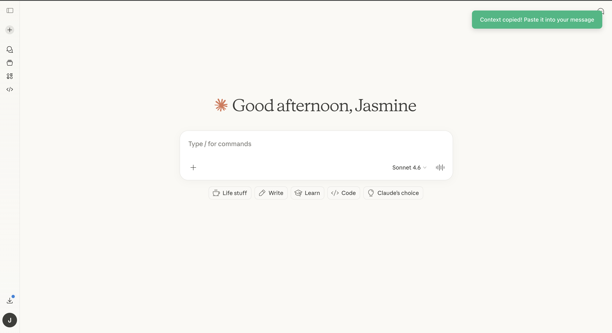
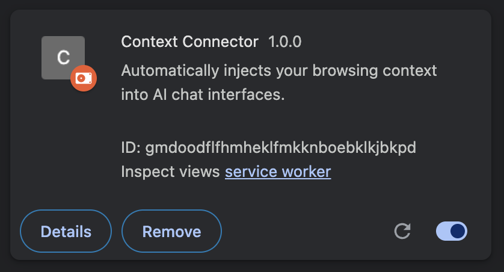
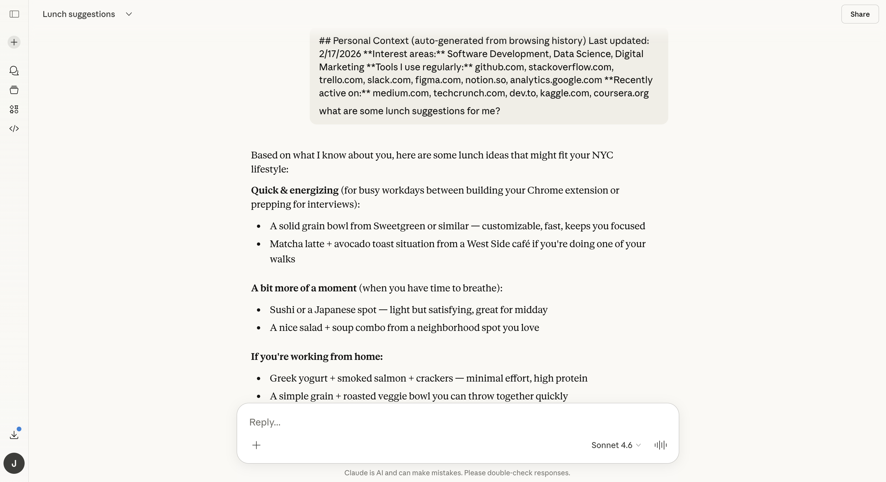

# Context Connector

**Stop re-explaining yourself to AI. One click to copy your browsing context into any conversation.**

Context Connector automatically analyzes your browsing history to understand your tools, interests, and projects — then lets you inject that context into Claude, ChatGPT, Grok, or Gemini with a single click.



---

## Why Context Connector?

Every AI conversation starts from zero. You waste time explaining:
- What tools you use daily (Linear, Figma, Notion...)
- Your interests and expertise areas
- Your current projects and research topics

Context Connector solves this by **automatically building a profile from your browsing history** and making it instantly available with one click.

---

## How it works

1. **Analyzes your history** — Scans your last 90 days of browsing
2. **Builds your profile** — Identifies your tools (10+ visits), interests (last 30 days), and topic areas
3. **One-click copy** — Beautiful floating button appears on new chats
4. **Paste & personalize** — Claude (or any LLM) instantly understands your context



---

## Installation

### From source

1. **Download this repo:**
   ```bash
   git clone https://github.com/jasminejobey/context-connector.git
   ```
   Or download as ZIP from the green "Code" button above

2. **Load in Chrome:**
   - Open `chrome://extensions/`
   - Enable **Developer mode** (toggle in top-right)
   - Click **Load unpacked**
   - Select the `context-connector` folder

3. **You're done!** The extension will sync your history automatically.



---

## Usage

1. **Open Claude, ChatGPT, Grok, or Gemini**
2. **Start a new chat** — you'll see the "Copy Context" button
3. **Click the button** — your context is copied to clipboard
4. **Paste into your first message** — the AI now knows your background!



The button automatically disappears after use or if the conversation already has messages.

---

## Privacy & Security

- **100% local processing** — your data never leaves your browser
- **No external servers** — all analysis happens on your computer
- **No data collection** — we don't see or store anything
- **Open source** — review the code yourself
- **Automatic blocklist** — excludes banking, health, auth pages

Your browsing history is private. Context Connector respects that.

---

## What's in your context profile?

The extension generates a clean summary like this:

```
## Personal Context (auto-generated from browsing history)
Last updated: 2/17/2026

**Interest areas:** Product Management, AI & Machine Learning, Fashion & Style
**Tools I use regularly:** linear.app, notion.so, figma.com, github.com, claude.ai
**Recently active on:** vogue.com, net-a-porter.com, ssense.com, anthropic.com
```

This gives LLMs immediate understanding of:
- Your professional domain
- Tools you're familiar with
- Current interests and research areas

---

## Customization

Want to add your own sites to topic detection? Edit `src/background.js`:

```javascript
topicMap: {
  "Your Custom Topic": [
    "yourfavoritesite.com",
    "anotherdomain.com"
  ]
}
```

The extension automatically rescans your history daily.

---

## Roadmap

- [x] Core functionality: history analysis + copy button
- [x] Support for Claude, ChatGPT, Grok, Gemini
- [x] Smart button visibility (only on new chats)
- [ ] Manual sync button in popup UI
- [ ] Export/import context profiles
- [ ] Custom topic categories in settings
- [ ] Advanced filtering (exclude domains, time ranges)
- [ ] Chrome Web Store submission

---

## Contributing

Contributions welcome! This is an early-stage project with lots of room for improvement.

**Ideas for contributors:**
- Add support for more LLM platforms
- Improve topic detection accuracy
- Build a settings UI for customization
- Add Firefox/Safari support
- Improve context formatting options

Open an issue or submit a PR!

---

## License

MIT License - see [LICENSE](LICENSE) for details.

---

## Acknowledgments

Built by [@jasminejobey](https://github.com/jasminejobey)

Inspired by the need for better AI personalization without sacrificing privacy.

---

## Support

Questions? Issues? Ideas?
- **GitHub Issues:** [Report a bug or request a feature](https://github.com/jasminejobey/context-connector/issues)
- **Twitter:** Share your experience with `#ContextConnector`

---

**Made with love for people who talk to AI all day**
